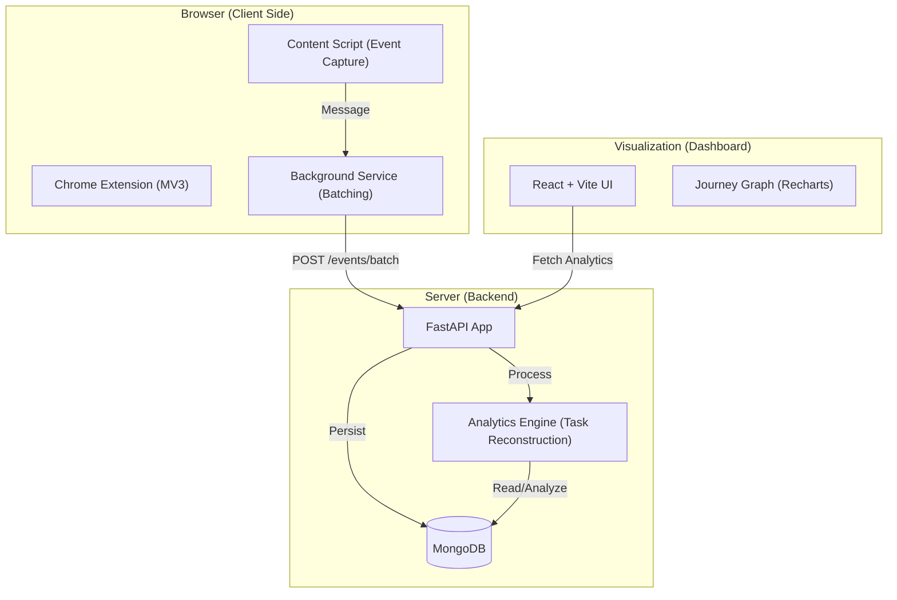

# 🧠 WebRecall: User Journey Mining System

A production-grade system to track, mine, and visualize user behavioral flows across multiple websites. Transform raw browser events into structured "tasks" and intent clusters using Markov models and AI.

---

## 🏗️ System Architecture



---

## 🎥 Video Walkthrough

[](https://www.loom.com/share/b87c9da75ca74b06b93fc0033dffd75a)

*(Click the badge above to watch a detailed explanation of the system in action.)*

## 🤖 AI-Powered Analysis

WebRecall leverages **Gemini 2.5 Flash** to transform raw event streams into high-level business intelligence.

### How it Works
1.  **Task Reconstruction**: The system groups individual events (clicks, scrolls) into "Tasks" based on time-gaps and domain shifts.
2.  **Context Injection**: The top 8 most relevant actions from each task, along with page titles and H1s, are sent to the AI.
3.  **Intelligent Synthesis**: Gemini generates:
    *   **Browsing Session Details**: A structured Markdown table including the primary intent for each domain visited.
    *   **Narrative Summary**: A 2-3 paragraph explanation of the user's workflow, inferred objectives, and outcomes.

> [!TIP]
> To enable this, ensure your `GOOGLE_API_KEY` is configured in `backend/.env`.

---

## 📄 Example Data Entry

This is a real-world example of a transition event captured by the [content.js](file:///c:/Users/ARNAV%20PANDEY/OneDrive/Desktop/webextension-recall/extension/content.js) and processed by the [FastAPI Backend](file:///c:/Users/ARNAV%20PANDEY/OneDrive/Desktop/webextension-recall/backend/main.py).

```json
{
  "session_id": "demo_sess_4921",
  "user_id": "user_demo_1",
  "timestamp": "2024-03-23T10:15:00.000Z",
  "domain": "google.com",
  "url": "https://www.google.com/search?q=how+to+use+fastapi",
  "page_title": "how to use fastapi - Google Search",
  "event_type": "click",
  "metadata": {
    "element": "A",
    "text": "FastAPI Documentation",
    "xpath": "//*[@id='rso']/div[1]/div/div/div/div/div/a",
    "link_url": "https://fastapi.tiangolo.com/",
    "page_h1": "how to use fastapi"
  }
}
```

*Source: Adapted from [scripts/generate_sample_data.py](file:///c:/Users/ARNAV%20PANDEY/OneDrive/Desktop/webextension-recall/scripts/generate_sample_data.py)*

---

## 📊 Browser Log Structure

The extension captures high-fidelity interaction logs. Below is the simplified schema for each `UserEvent`.

<details>
<summary><b>View Event JSON Schema</b></summary>

### Core Event Fields
| Field | Type | Description |
| :--- | :--- | :--- |
| `session_id` | `string` | Unique UUID for the current browsing session. |
| `user_id` | `string` | Anonymous identifier for the user. |
| `timestamp` | `ISO8601` | When the event occurred. |
| `domain` | `string` | e.g., `github.com` |
| `event_type` | `string` | `click`, `input`, `submit`, `page_load`, `scroll`. |

### Metadata Fields
| Field | Description |
| :--- | :--- |
| `element` | Tag name of the interacted element (e.g., `BUTTON`). |
| `text` | Visible text content (truncated for privacy). |
| `page_h1` | Primary heading of the current page. |
| `search_query` | Extracted search terms (if on a search engine). |
| `page_schema` | Structured data (JSON-LD) detected on the page. |

</details>

---

## 🚀 Correct Way to Run the Project

Follow these steps in order to ensure all components communicate correctly.

### 1. Prerequisites
- **MongoDB**: Ensure MongoDB is running locally on `mongodb://localhost:27017`.
- **Python 3.9+** & **Node.js (v18+)**.

### 2. Backend Setup
```bash
cd backend
python -m venv venv
source venv/bin/activate  # Windows: venv\Scripts\activate
pip install -r requirements.txt
# Create a .env file with your GOOGLE_API_KEY
python main.py
```

### 3. Frontend Dashboard
```bash
cd frontend
npm install
npm run dev
```
*The dashboard will be available at `http://localhost:5173`.*

### 4. Chrome Extension
1. Open Chrome and go to `chrome://extensions/`.
2. Enable **Developer mode** (top right).
3. Click **Load unpacked** and select the `extension/` folder in this repository.
4. Pin the extension and click "Start Session" in the popup.

---

## 🔧 Folder Structure

```text
├── extension/      # Chrome Extension (Manifest V3)
├── backend/        # FastAPI Server & MongoDB Logic
├── analytics/      # Journey Reconstruction Engine (Markov Models)
├── frontend/       # React (Vite) Dashboard & Visualizations
└── scripts/        # Seeding & Utility scripts
```

## 🛡️ Privacy & Security
- **Sensitive Data**: Fields matching "password", "token", "ssn", etc., are automatically ignored at the source.
- **Local First**: Data is sent only to your configured backend endpoint.
