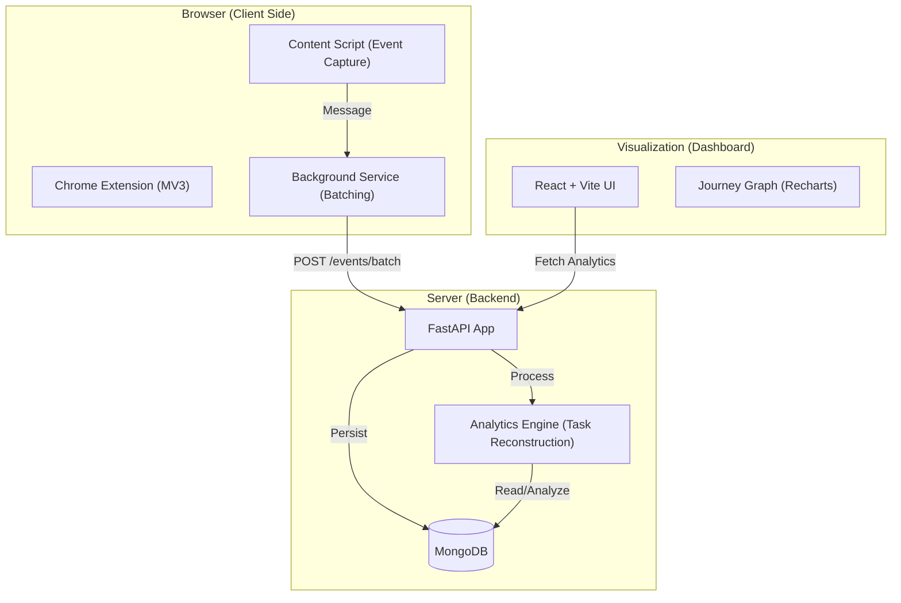

# 🧠 WebRecall: User Journey Mining System

A production-grade system to track, mine, and visualize user behavioral flows across multiple websites. Transform raw browser events into structured "tasks" and intent clusters using Markov models and AI.

---

## 🏗️ System Architecture



---

## 🎥 Video Walkthrough

[](https://www.loom.com/share/your_loom_id_here)

*(Click the badge above to watch a detailed explanation of the system in action.)*

---

## 📊 Browser Log Structure

The extension captures high-fidelity interaction logs. Below is the simplified schema for each `UserEvent`.

<details>
<summary><b>View Event JSON Schema</b></summary>

### Core Event Fields
| Field | Type | Description |
| :--- | :--- | :--- |
| `session_id` | `string` | Unique UUID for the current browsing session. |
| `user_id` | `string` | Anonymous identifier for the user. |
| `timestamp` | `ISO8601` | When the event occurred. |
| `domain` | `string` | e.g., `github.com` |
| `event_type` | `string` | `click`, `input`, `submit`, `page_load`, `scroll`. |

### Metadata Fields
| Field | Description |
| :--- | :--- |
| `element` | Tag name of the interacted element (e.g., `BUTTON`). |
| `text` | Visible text content (truncated for privacy). |
| `page_h1` | Primary heading of the current page. |
| `search_query` | Extracted search terms (if on a search engine). |
| `page_schema` | Structured data (JSON-LD) detected on the page. |

</details>

---

## 🚀 Correct Way to Run the Project

Follow these steps in order to ensure all components communicate correctly.

### 1. Prerequisites
- **MongoDB**: Ensure MongoDB is running locally on `mongodb://localhost:27017`.
- **Python 3.9+** & **Node.js (v18+)**.

### 2. Backend Setup
```bash
cd backend
python -m venv venv
source venv/bin/activate  # Windows: venv\Scripts\activate
pip install -r requirements.txt
# Create a .env file with your GOOGLE_API_KEY
python main.py
```

### 3. Frontend Dashboard
```bash
cd frontend
npm install
npm run dev
```
*The dashboard will be available at `http://localhost:5173`.*

### 4. Chrome Extension
1. Open Chrome and go to `chrome://extensions/`.
2. Enable **Developer mode** (top right).
3. Click **Load unpacked** and select the `extension/` folder in this repository.
4. Pin the extension and click "Start Session" in the popup.

---

## 🔧 Folder Structure

```text
├── extension/      # Chrome Extension (Manifest V3)
├── backend/        # FastAPI Server & MongoDB Logic
├── analytics/      # Journey Reconstruction Engine (Markov Models)
├── frontend/       # React (Vite) Dashboard & Visualizations
└── scripts/        # Seeding & Utility scripts
```

## 🛡️ Privacy & Security
- **Sensitive Data**: Fields matching "password", "token", "ssn", etc., are automatically ignored at the source.
- **Local First**: Data is sent only to your configured backend endpoint.
